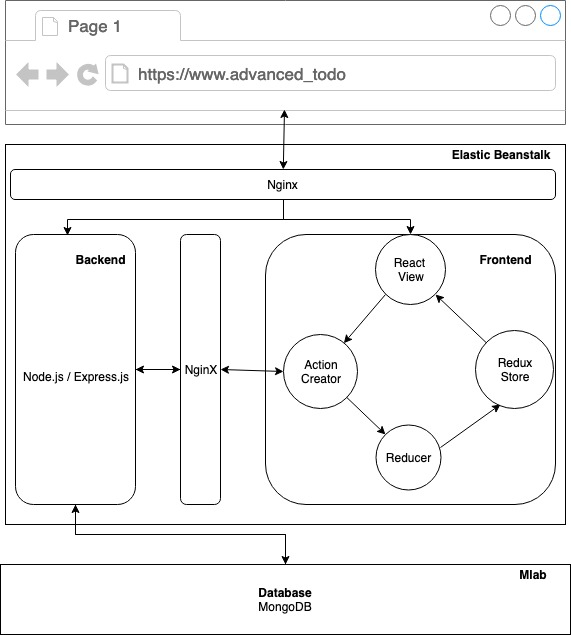

# TODO APP 


Advanced Todo application is a task management tool. You can create, edit, and delete multiple todo lists. Also, it calculates how far away from being done you are. Each todo inside of the lists can be differently colored by its degree of importance.


## Notable features
- Build a CI + CD pipeline from scratch with Github, Travis CI, and AWS
- Automatically deploy the code when it is pushed to Github
- Utilize the Docker CLI to inspect and debug running containers
- Have full authentication flow using Google and Facebook Oauth

## Deloyment process 
1. Push code to github 
2. Travis automatically pulls repo
3. Travis builds a test image and test code
4. Travis build production images 
5. Travis pushes built production images to Docker Hub
6. Travis pushes project to AWS EB
7. EB pulls images from Docker Hub and delploy

## Application Structure


## Run in a local enviornment
Create and customize your own key.js in server/config 
```
module.exports = {
    'googleAuth' : {
        'clientID' : 'YOUR_GOOGLE_AUTH_ID',
        'clientSecret' : 'YOUR_CLIENT_SECRET',
        'callbackURL' : 'http://localhost:3050/auth/google/callback'
    },
    'facebookAuth' : {
        'clientID'      : 'YOUR_CLIENT_ID', 
        'clientSecret'  : 'YOUR_CLIENT_SECRET', 
        'callbackURL'   : 'http://localhost:3050/auth/facebook/callback'
    },
    mongoURI : 'YOUR_MONGO_URL',
    cookieKey: 'RANDOMLY_GENEREATED_KEY',
}
```
Install Docker and enter follwoing line
```
docker-compose up --build
```
## Built With
* [Docker](https://www.docker.com/) - computer program that performs operating-system-level virtualization
* [AWS Elastic Beanstalk](https://aws.amazon.com/elasticbeanstalk/) - an orchestration service offered from Amazon Web Services for deploying infrastructure which orchestrates various AWS services, including EC2, S3, Simple Notification Service, CloudWatch, autoscaling, and Elastic Load Balancers. 
* [AWS VPC](https://aws.amazon.com/vpc/) - enables you to define a virtual network in your own logically isolated area within the AWS cloud,
* [AWS IAM](https://aws.amazon.com/iam/) - AWS Identity and Access Management (IAM) enables you to manage access to AWS services and resources securely.
* [Travis CI](https://travis-ci.org/) - Travis CI is a hosted, distributed continuous integration service used to build and test software projects hosted at GitHub
* [Nginx](https://www.nginx.com/) - Nginx is a web server which can also be used as a reverse proxy, load balancer, mail proxy and HTTP cache
* [React](https://reactjs.org/) - Used to build client side
* [Redux](http://redux.js.org/docs/basics/UsageWithReact.html) - Predictable state container for JavaScript apps
* [Node.js](https://nodejs.org/en/) - Used to build client side 
* [Express.js](http://expressjs.com/) - Framework for Node.js
* [MongoDB](https://www.mongodb.com/) - Used to build database 
* [mongoose.js](http://mongoosejs.com/) - MongoDB ODM for Node.js
* [mlab](https://mlab.com/) -  Cloud MongoDB service

## Authors

* **Geon Yoon ** - *Initial work* - [GeonYoon](https://github.com/GeonYoon)
