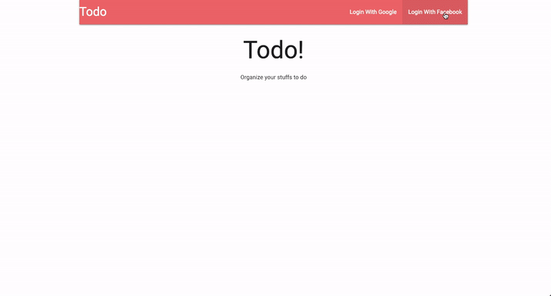

# TODO APP 



Todo application is a task management tool that runs in a web browser. You can create, edit, and delete multiple todo lists. Also, it calculates how much you're close to being done with the relevant list. Each todo inside of the lists could be differently colored by its degree of importance.

The main feature of this application is the heavy use of Redux. Most calculation of this app is done inside of the browser, not in the backend server. Processed data are going to send back to the backend, and they are saved in MongoDB database. You can sign into this application by using both Google and Facebook accounts.


## How To Use

### Install in your local machine 

Install node modules in both root directory(server-side) and client folder(client-side) 
```
npm install  
cd client  
npm install  
cd..
```
Customize your own key.js in server/config 
```
module.exports = {
    'googleAuth' : {
        'clientID' : 'YOUR_GOOGLE_AUTH_ID',
        'clientSecret' : 'YOUR_CLIENT_SECRET',
        'callbackURL' : '/auth/google/callback'
    },
    'facebookAuth' : {
        'clientID'      : 'YOUR_CLIENT_ID', 
        'clientSecret'  : 'YOUR_CLIENT_SECRET', 
        'callbackURL'   : '/auth/facebook/callback'
    },
    mongoURI : 'YOUR_MONGO_URL',
    cookieKey: 'RANDOMLY_GENEREATED_KEY',
}
```

Run the application by entering following line in the root directory

```
npm run dev
```

## Built With

* [React](https://reactjs.org/) - Used to build client side
* [Redux](http://redux.js.org/docs/basics/UsageWithReact.html) - Predictable state container for JavaScript apps
* [Node.js](https://nodejs.org/en/) - Used to build client side 
* [Express.js](http://expressjs.com/) - Framework for Node.js
* [MongoDB](https://www.mongodb.com/) - Used to build database 
* [mongoose.js](http://mongoosejs.com/) - MongoDB ODM for Node.js
* [mlab](https://mlab.com/) -  Cloud MongoDB service
* [Passport.js](http://www.passportjs.org/) - Passport is authentication middleware for Node.js

## Authors

* **Geon Yoon ** - *Initial work* - [GeonYoon](https://github.com/GeonYoon)
